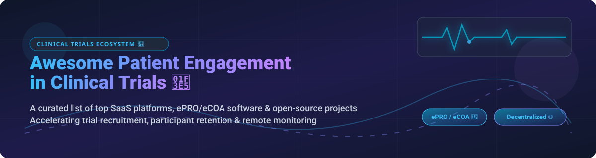

  

# 🏥 Awesome Clinical Trials Patient Engagement 🧪

  
  
  
  
  

## 🌟 Ecosystem Overview & Industry Insights 💡

Welcome to the ultimate curated list of **SaaS platforms** and **open-source GitHub projects** for **Patient Engagement in Clinical Trials**, **ePRO/eCOA (electronic Patient-Reported Outcomes / Clinical Outcome Assessment)**, and **Decentralized Clinical Trials (DCTs)**.

> [!IMPORTANT]
> **Market Size & Structure**: The global **Patient Engagement in Clinical Trials & Recruitment** market size is estimated at **$4.49 Billion in 2026** (part of the broader $30.4B Patient Engagement Solutions market) and is projected to expand significantly by 2035. The sector is currently **highly fragmented**, featuring specialized software for ePRO/eCOA, telehealth, and symptom tracking alongside large Contract Research Organization (CRO) suites.

---

## 📋 Table of Contents 🗂️

- [💼 SaaS/Hosted Platforms](#-saashosted-platforms)
- [🔓 Open-Source GitHub Projects](#-open-source-github-projects)
- [🤝 How to Contribute](#-how-to-contribute)
- [💖 Support & Sponsorship](#-support--sponsorship)
- [⚠️ Disclaimer](#%EF%B8%8F-disclaimer)
- [📈 Star History](#-star-history)

---

## 💼 SaaS/Hosted Platforms

The following enterprise clinical trial software platforms are sorted in descending order by company valuation/revenue size.

| Platform | Valuation / Size | Starting Pricing | Free Tier / Trial Limit | Key Capabilities |
| :--- | :--- | :--- | :--- | :--- |
| **[Clario](https://clario.com/)** 🏢 | **~$8.9B Valuation** ($1.2B+ Revenue) | **$15,000 / study** starting license | No free tier; **Demo access only** via sales consultation | Enterprise eCOA, ePRO, wearable integrations, cardiac safety, and precision clinical endpoints. |
| **[Medable](https://www.medable.com/)** 🦄 | **$2.1B Valuation** ($73.5M Est. Revenue) | **$10,000 / study** portfolio package | No software free trial; **Free learning trial** via Medable Academy certification | Decentralized trial (DCT) platform, BYOD eCOA, eConsent, and remote patient monitoring. |
| **[Florence Healthcare](https://florencehc.com/)** 🏥 | **~$120M Funding** ($50M+ Revenue) | **$500 / month** per site | **14-day free trial** for site document portal module | Site-centric clinical trial workflow, patient eConsent, eBinders, and participant communication. |
| **[Science 37](https://www.science37.com/)** 🌐 | **$38M Acquisition** ($59M Revenue) | **$8,000 / study** deployment | No free plan; **Guided sandbox trial** upon enterprise demo request | Metasite unified virtual trial OS, telemedicine, eConsent, ePRO, and remote mobile nurse dispatch. |
| **[Castor](https://www.castoredc.com/)** 📊 | **~$65M Funding** ($38.5M Est. Revenue) | **$250 / month** (Academic/Small Study) | **14-day full feature trial** (No permanent free tier) | Cloud EDC, ePRO/eCOA, eConsent, randomization, and patient engagement mobile apps. |
| **[ObvioHealth](https://www.obviohealth.com/)** 📱 | **~$31M Funding** ($15M Est. Revenue) | **$5,000 / study** baseline | No free tier; **Custom pilot study trial** available upon request | Direct-to-patient decentralized clinical trial platform with claim validation and digital biomarkers. |
| **[YPrime](https://www.yprime.com/)** ⚡ | **~$19.6M Funding** ($12M Est. Revenue) | **$6,000 / study** base tier | No free tier; **Interactive demo environment** upon request | Interactive Response Technology (IRT), eCOA, ePRO, and rapid clinical trial data management. |
| **[Curebase](https://www.curebase.com/)** 🩺 | **~$57.6M Funding** ($8M–$17.7M Revenue) | **$4,000 / study** startup package | No free plan; **30-day sandbox trial** for qualified sponsors | Decentralized & hybrid clinical trial platform with ePRO, virtual coordinator tools, and eConsent. |
| **[THREAD Science](https://www.threadresearch.com/)** 🔬 | **Private PE-backed** (~$30M Est. Revenue) | **$7,500 / study** core module | No public free trial; **Sandbox environment** provided during onboarding | Turnkey DCT architecture with adaptive eCOA, telehealth visits, and sensor data capture. |
| **[Signant Health](https://www.signanthealth.com/)** 📝 | **Private Enterprise** (~$10M+ Revenue) | **$12,000 / study** deployment | No free tier; **Demo walk-through** available on demand | Deep eCOA instrument licensing, global linguistic validation, Smart Signals, and patient retention. |

---

## 🔓 Open-Source GitHub Projects

Below is a curated collection of active open-source clinical trial patient engagement tools, ePRO frameworks, and clinical research tools, sorted by GitHub Stars_Count in descending order.

| Project & Repository | GitHub_Stars | License | Key Features | Tech Stack |
| :--- | :--- | :--- | :--- | :--- |
| **[OpenClinica](https://github.com/OpenClinica/OpenClinica)** 📊  |  | LGPL-2.1 | **Participate ePRO Module**: Zero-friction patient surveys via web/mobile without app downloads. Automated SMS/email reminders. | Java, PostgreSQL, AngularJS |
| **[AdEPro](https://github.com/Bayer-Group/AdEPro)** 🎨  |  | GPL-3.0 | **Adverse Event Animation**: Audio-visual patient safety monitoring app developed by Bayer for clinical trial side-effect visualization. | R, Shiny, CDISC ADaM |
| **[Clinical-Trial-Parser](https://github.com/facebookresearch/Clinical-Trial-Parser)** 🤖  |  | CC-BY-NC-4.0 | **Eligibility Criteria Parser**: NLP tool by Meta Research to parse clinical trial criteria for automated patient-trial matching. | Python, PyTorch, NLP |
| **[TrialGPT](https://github.com/ncbi-nlp/TrialGPT)** 🧠  |  | MIT | **AI Patient-Trial Matching**: NIH/NCBI benchmark for matching clinical trial eligibility with patient records using LLMs. | Python, OpenAI API, Transformers |
| **[OpenStudyBuilder](https://github.com/NovoNordisk-OpenSource/OpenStudyBuilder)** 🏗️  |  | MIT | **Clinical Protocol & eCOA Builder**: Novo Nordisk's open platform to define end-to-end clinical study specs and patient tasks. | Python, Neo4j, Vue.js, FastAPI |
| **[Arcwell](https://github.com/arcweb/arcwell)** ⚙️  |  | Apache-2.0 | **Clinical Rules Engine & eCOA**: Production-proven clinical research platform powering 4,000+ custom rules at Penn Medicine. | TypeScript, Node.js, PostgreSQL |
| **[PROACT 2.0](https://github.com/Proact2)** 💬  |  | MPL-2.0 | **Patient-Doctor Oncology App**: Secure text, audio & video communication between cancer patients and clinicians in trials. | .NET 6, C#, React.js, Xamarin |
| **[REDCap + MyCap Framework](https://projectredcap.org/)** 📱  |  | Consortium / Free | **Participant Mobile App**: Free patient-facing mobile application for non-profit research, offline active tasks & ePRO. | Swift, Kotlin, PHP API |

---

## 🤝 How to Contribute 🚀

Contributions are welcome! Help us maintain the most comprehensive index for clinical trial patient engagement tools:

1. 🍴 **Fork** the repository.
2. 📝 **Add/Edit** entries in `README.md` following the tabular layout.
3. 🔒 Ensure descriptions are objective and link to official sources.
4. 📬 Submit a **Pull Request** with details of your additions.

Check out [Awesome-Awesome-Awesome](https://github.com/ishandutta2007/Awesome-Awesome-Awesome) for more curated lists!

---

## 💖 Support & Sponsorship ☕

If you find this repository useful for your research, clinical operations, or healthcare technology stack:

- ⭐ **Star** this repository to show your support!
- 🔀 **Fork** it to keep a copy for your team.
- 📣 **Share** with colleagues in clinical research & healthtech.
- ☕ **Buy me a coffee**: Support ongoing open-source curation on our [GitHub Sponsor Dashboard](https://github.com/sponsors/ishandutta2007)!

---

## ⚠️ Disclaimer 📜

- This list is **community-curated** for information purposes and does not constitute an endorsement.
- Clinical trial tools handling sensitive personal and health data must strictly adhere to regulatory standards including **21 CFR Part 11, ICH-GCP, HIPAA, and GDPR**.

---

## 📈 Star History

